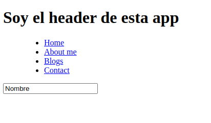

# Manipulando elementos del DOM
Para poder manipular los elementos en el DOM, podemos hacer uso del método `console.dir()` el cual nos lista todos los atributos que contiene un elemento, y así poder elegir el atributo que queremos manipular.

```javascript
const title = document.querySelector("#app-title")
console.dir(title)
```
## Modificando atributos y propiedades
Tenemos de ejemplo el siguiente documento y script:


Del cual le modificaremos un atributo a un elemento.

**1. Primero seleccionamos el elemento al que le vamos a modificar el atributo:**

Elemento:
```html
<main>
    <!-- Attributes are part of HTML, like id, class, type, value, etc -->
    <input id="input-id" class="input-class" type="text" value="Nombre">
</main>
```
Selección con JS:
```javascript
const input = document.querySelector("input")
console.log(input)
```
Resultado:
```html
<input id="input-id" class="input-class" type="text" value="Nombre">
```
**2. Después cambiamos el atributo `value` de `input`:**

```javascript
input.value
// 'Nombre'
input.value = "Apellido"
input.value
// 'Apellido'
console.log(input)
```
Resultado:


```javascript
<input id="input-id" class="input-class" type="text" value="Nombre">
```
En el ejemplo vemos que en la interfaz de usuario el atributo `value` del elemento `input` cambia cuando lo modificamos en el script, pero cuando llamamos a nuestra constante input, vemos que sigue teniendo el valor "Nombre", esto es porque lo que se esta modificando es a nivel DOM, no el atributo HTML del elemento.

<br>

## Modificando texto en HTML
Siguiendo con el mísmo ejemplo



Cambiaremos el texto del título:

```javascript
// Almacenamos el elemento en una constante 'title'
const title = document.querySelector("#app-title")

// Buscamos el texto del elemento
console.dir(title)

// Tenemos dos formas de cambiarlo, con textContent y con innerText
// Cambiando el texto con textContent
title.textContent = "Nuevo Título con textContent"
// Cambiando el texto con innerText
title.innerText = "Nuevo Título con innerText"
```

textContent:


innerText:


<br>

## Modificando estilos en HTML

